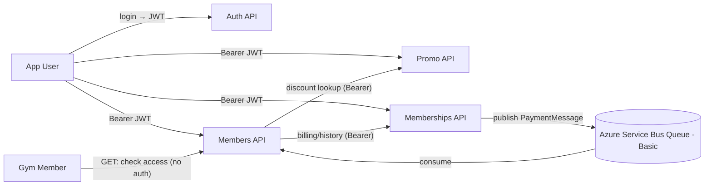

# GymManagement Microservices (Backend-only)

**Goal:** learn microservices and how they communicate in .NET.  
**Scope:** REST CRUD + **basic Azure Service Bus (queue)** integration. **No frontend** (backend-only).

## TL;DR — Reviewer Summary
- **.NET 9 microservices**: Auth, Members (hub), Memberships, Promo.
- Sync HTTP for queries/commands; **async** messaging for billing results (**Service Bus Basic** queue).
- **Members** is the integration hub: validates staff (Auth), checks discounts (Promo), updates access from **PaymentMessage** (Memberships).
- Focus was **architecture & communication patterns**; intentionally **no frontend**, **no Azure deploy**, and **minimal ops**.

> **Why no Azure deploy?** Deploying microservices well adds CI/CD, container orchestration, APIM, etc. That infra work wasn’t the learning goal here; this repo is to show **service boundaries + messaging**. Future repos will cover deployment and platform concerns.

## What this shows
- Separate services with clear boundaries (**Auth**, **Members**, **Memberships**, **Promo**).
- Sync HTTP between services + **async messaging** via Service Bus (Basic tier, queue).
- **Messaging demo:** **Memberships** publishes `PaymentMessage` (success/failure) → **Members** consumes → extends or cancels membership.

## Architecture

> Context: Using **Service Bus Basic** (queues only; no topics/sessions). Migrations run at startup in dev; in prod you’d handle them in CI/CD or a one-off job.

## Services
- `GymManagement_Auth_Microservice` – token issuance (staff)  
- `GymManagement_Members_Microservice` – members CRUD; **consumes** payment messages; central orchestrator  
- `GymManagement_MemberShips_Microservice` – billing job; **publishes** payment messages and writes payment history  
- `GymManagement_Promo_Microservice` – discount lookup  
- `GymManagement_Shared_Classes` – shared **JWT/Swagger/EF** helpers + DTOs/contracts

## Notes / trade-offs
- Stopped when it became “more of the same” — goal was **service boundaries + messaging**, not feature breadth.
- **No tests here** (covered in day job);
- **No Azure deployment** in this repo by design (see rationale above).
